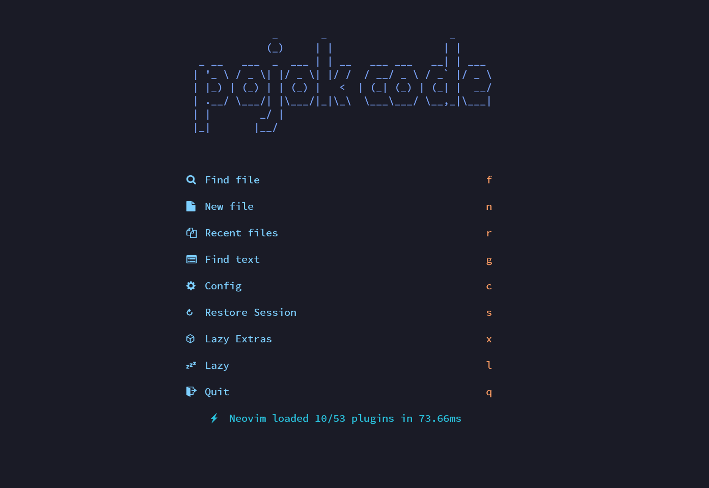
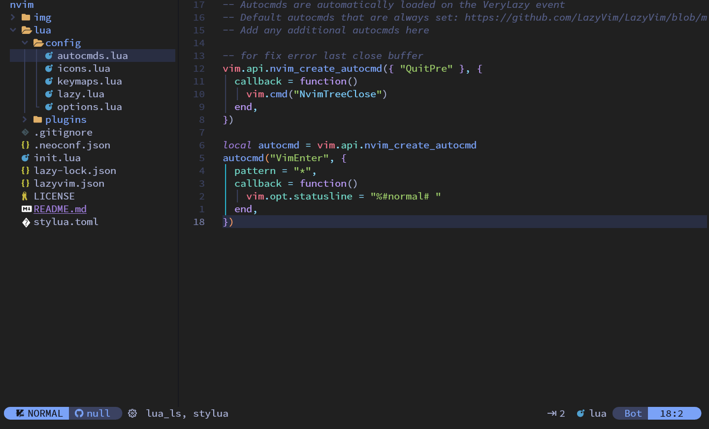

# 💤 Overide LazyVim

A starter template for [LazyVim](https://github.com/LazyVim/LazyVim).
Refer to the [documentation](https://lazyvim.github.io/installation) to get started.

## Dashboard



## Home



## Basic Requirement

2. Install Neovim 9.0+ https://github.com/neovim/neovim/releases/tag/stable
3. C++ (windows) Compiler https://www.msys2.org/
4. GIT https://git-scm.com/download/win
5. NodeJs https://nodejs.org/en/
6. Ripgrep https://github.com/BurntSushi/ripgrep
7. Lazygit https://github.com/jesseduffield/lazygit
8. Nerd Font https://github.com/ryanoasis/nerd-fonts
9. Windows Terminal (Windows) https://apps.microsoft.com/store/detail/windows-terminal/9N0DX20HK701?hl=en-id&gl=id
10. Powershell (windows) https://apps.microsoft.com/store/detail/powershell/9MZ1SNWT0N5D?hl=en-id&gl=id

# Windows

```
git clone https://github.com/pojokcodeid/overide-lazyvim.git "$env:LOCALAPPDATA\nvim"
nvim
```

# Linux

```bash
git clone https://github.com/pojokcodeid/overide-lazyvim.git ~/.config/nvim
```
